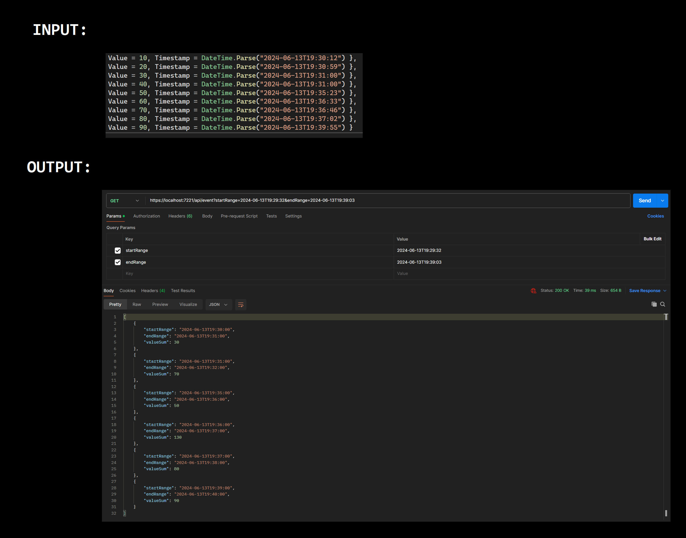
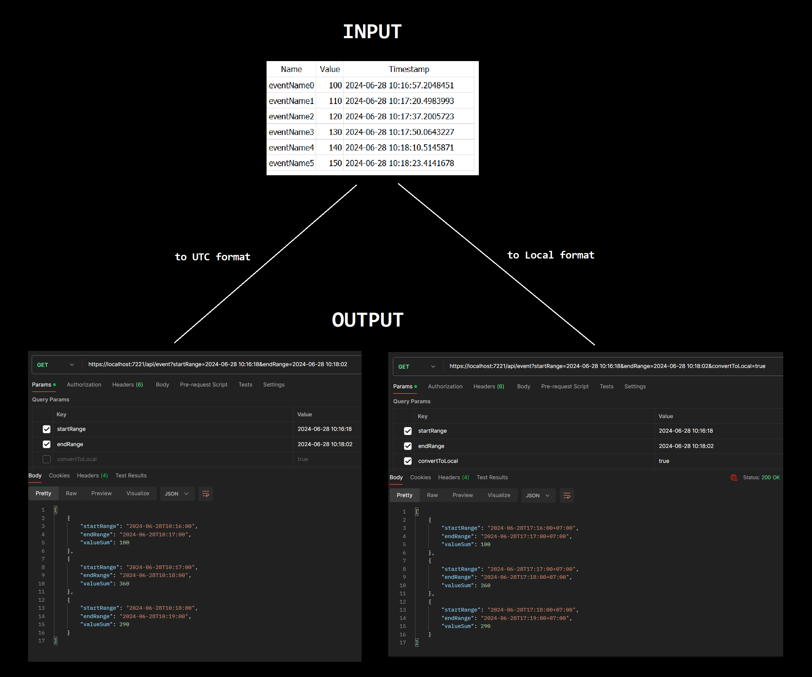

# Event keeper API

## Description
API to manipulate `Event` enteties.

`Event` has fields:
- `Name` (event name)
- `Value` (event weight)
- `Timestamp` (add date to DB)

Available `Event` API:
- `Add`
- `Get` (filtered by date range)

## Development technologies
Backend: ASP.Net.Core WEB API + Entity Framework Core + SQLite

## API
### Add
`Add` require `POST` request with body like:
```json
{
  "name": "EVENT_NAME",
  "value": 100
}
```

Field `Timestamp` for `Event` entity set automatically when request sended (Uses `UTC`)

### Get
`Get` require `GET` request with parameters like:
```
https://localhost:7221/api/event?startRange=2024-06-13T21:15:32&endRange=2024-06-13T21:16:03&convertToLocal=true
```

Fields:
- `startRange`
- `endRange`
- `convertToLocal` (Unnecessary field)

`Event` entities with `Timestamp` field that fall within range [`startRange`; `endRange`] will be selected
Range requires `UTC` format. The response format depends on the `convertToLocal` parameter (`UTC` for `true` or no parameter, `Local` for `false`)

<details>
  <summary>Example 1 (Client - <code>Postman</code>)</summary>
  
</details>

<details>
  <summary>Example 2 - Get <code>UTC/Local</code> format (Client - <code>Postman</code>)</summary>
  
</details>

#### Rounding
Input range values can contains seconds therefore it's necessary to make a decision how to calculate time filter
In this API:
- `startRange` - round down (seconds are discarded)
- `endRange` - round up (to a whole minute)

Example:
```
Before - [19:29:32 - 19:31:03]
After - [19:29:00 - 19:32:00]
```

<details>
  <summary>Round up explanation (<code>C#</code> example)</summary>
  For example, it's <code>37</code> <code>M</code>inutes now and we need to round it up to a <code>10</code> minute <code>I</code>nterval <br>
  So, we can use such expression:
  <code>I - (M mod I)</code> <br>
  We get: <code>10 - (37 mod 10) = 10 - 7 = 3</code> (We need <code>3</code> minutes to reach the nearest <code>10</code> minute interval: <code>37+3=40</code>)
  
  <br><br>
  
  To round up to a minute in <code>C#</code> we can use this approach: <br>
  ```csharp
  public DateTime RoundMinuteUp(DateTime date)
  {
      var ticksToWholeMinute = TimeSpan.TicksPerMinute - (date.Ticks % TimeSpan.TicksPerMinute);
      return date.AddTicks(ticksToWholeMinute);
  }
  ```
  
</details>


